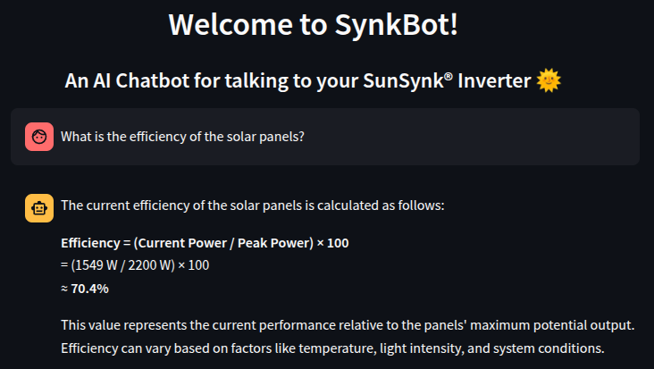

# SynkBot
**SynkBot** is a chatbot for communicating with a SunSynk® inverter using Ollama, a Qwen3 LLM and [synkctl](https://github.com/hammingweight/synkctl).

## Installing dependencies
Install [synkctl](https://github.com/hammingweight/synkctl/releases/tag/v1.13.0) and follow the configuration instructions. Check that it works

```bash
synkctl configuration verify
```

Create a python virtual environment

```bash
git clone https://github.com/hammingweight/SynkBot.git
cd SynkBot
python3 -m venv venv
source venv/bin/activate
pip install -r requirements.txt
```

Install Ollama and the Qwen3 LLM

```bash
curl -fsSL https://ollama.com/install.sh | OLLAMA_VERSION=0.11.4 sh 
ollama pull qwen3:4b-q4_K_M
```

## Running SynkBot
**SynkBot** is a [Streamlit application](https://streamlit.io); to run it

```bash
source venv/bin/activate
PYTHONPATH=src streamlit run streamlit/app.py
```

## Examples
You can ask the chatbot questions about the inverter, solar panels, battery and grid. For example



**SynkBot** is a ReAct (reason and act) application; the console shows its reasoning (AI messages) and actions (tool messages)
```
(venv) cmeijer@hubble:~/workspaces/SynkBot$ PYTHONPATH=src streamlit run streamlit/app.py 

  You can now view your Streamlit app in your browser.

  Local URL: http://localhost:8502
  Network URL: http://192.168.1.59:8502

================================ Human Message =================================

What is the efficiency of the solar panels?
================================== Ai Message ==================================

<think>
Okay, the user is asking about the efficiency of the solar panels. Let me think about how to approach this.

First, I need to recall which functions are available. The tools provided include functions for checking the grid state, input state, battery state, inverter settings, etc. The input_state function retrieves the current input state for solar panels, which probably includes power and peak power values. 

Efficiency of solar panels is typically calculated as the ratio of electrical output to the solar input. But since the user is asking for the efficiency, I need to check if the input_state function provides the necessary data. The input_state function's description says it fetches input power and peak power values. If I can get the current power and peak power, maybe I can compute the efficiency. However, the function might not directly provide efficiency, but the user might be expecting that.

...

Therefore, the correct action is to call input_state to get the input power and peak power, then compute the efficiency. So I'll proceed to call the input_state function.
</think>
Tool Calls:
  input_state (ff574748-8f63-4312-9237-e34ba1e141cc)
 Call ID: ff574748-8f63-4312-9237-e34ba1e141cc
  Args:
    inverter_serial_number: 0
================================= Tool Message =================================
Name: input_state

power=1549 peakPower=2200
================================== Ai Message ==================================

<think>
Okay, the user asked about the efficiency of the solar panels. I called the input_state function, which returned a power of 1549 and a peak power of 2200. Now I need to calculate the efficiency.

Efficiency is typically calculated as (current power / peak power) * 100. So plugging in the numbers: 1549 divided by 2200 equals approximately 0.704, and multiplying by 100 gives 70.4%. 

Wait, but I should check if the units are correct. The power values are in watts, so the ratio is unitless. The calculation seems right. But maybe the peak power is the maximum possible, so under ideal conditions, the efficiency is 70.4%. 

I should present this as the current efficiency. Also, note that efficiency can vary based on factors like temperature and light intensity, but since the user is asking for the current efficiency, this calculation should be accurate based on the latest data.
</think>

The current efficiency of the solar panels is calculated as follows:

**Efficiency = (Current Power / Peak Power) × 100**  
= (1549 W / 2200 W) × 100  
≈ **70.4%**

This value represents the current performance relative to the panels' maximum potential output. Efficiency can vary based on factors like temperature, light intensity, and system conditions.

```


